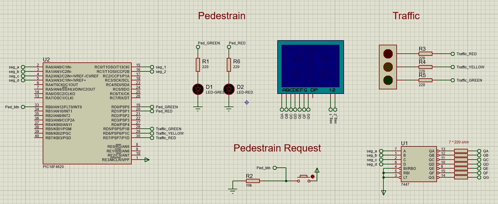

# PIC18 Traffic Light Controller
This is a Proteus simulation of a traffic light system built around the PIC18F4620 microcontroller. It manages standard traffic lights, pedestrian crossing signals, and a 2-digit 7-segment countdown timer.
## Project Simulation

